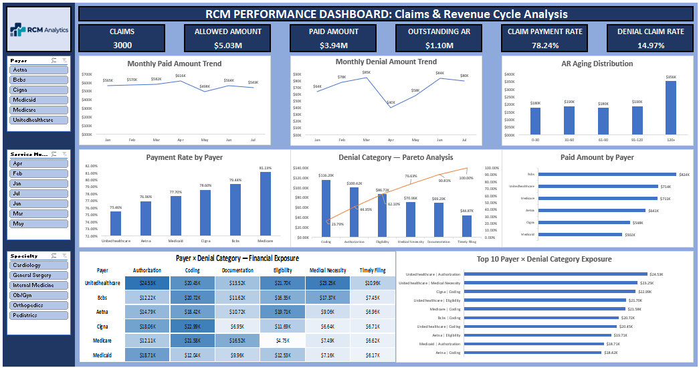

# Project 01 — RCM Claims & Revenue Cycle Analysis

## Overview

An Excel-based healthcare Revenue Cycle Management (RCM) analytics case study built on a **synthetic 3,000-claim dataset**.

The project converts claim-level operational data into a management-oriented view of:

- Accounts Receivable (AR) aging
- Denial financial exposure
- Payer × denial-category concentration
- Paid-revenue trends
- Investigation prioritization

The analysis is designed for both **RCM professionals** and **non-RCM readers**, with core RCM terminology explained in the accompanying case study.

---

## Business Questions

| ID | Business Question | Analysis |
|---|---|---|
| BQ01 | Where is AR concentrated? | Aging Analysis |
| BQ02 | Which denial categories drive exposure? | Denial Analysis |
| BQ03 | Which payer/category combinations drive denial dollars? | Payer × Denial Analysis |
| BQ04 | How does paid revenue change over time? | Monthly Trend |
| BQ05 | Which areas require prioritization? | Combined Analysis |

---

## Key Findings

### BQ01 — AR Concentration
The **120+ day aging bucket** contains **$355,589.53**, representing **32.46% of total outstanding AR**.

### BQ02 — Denial Exposure
**Coding, Authorization, Eligibility, and Medical Necessity** collectively account for **76.63% of total denial dollars**.

Adding **Documentation** increases cumulative coverage to **90.81%**.

### BQ03 — Payer × Denial Concentration
Denial exposure varies by payer.

- UnitedHealthcare: **60.73%** of its denied dollars are concentrated in Authorization, Medical Necessity, and Eligibility.
- Cigna: largest category exposure is Coding.
- Aetna: largest category exposure is Eligibility.
- Medicare and BCBS: notable Coding exposure.
- Medicaid: higher concentration in Authorization.

### BQ04 — Paid Revenue Trend
Paid revenue reached its highest observed monthly value in **April: $616,495.78**.

It then declined to **$497,701.63 in May**, recovered in June, and declined slightly again in July.

The analysis identifies the movement but does **not** establish the cause of the May decline.

### BQ05 — Investigation Prioritization
The four largest denial categories cover **76.63% of denial dollars**.

The **Top 10 payer × denial combinations** total **$212,052.23**, representing **43.41% of total denial dollars**.

This is a prioritization framework for **investigation**, not a guaranteed recovery or savings estimate.

---

## Executive KPI Snapshot

| KPI | Value |
|---|---:|
| Total Claims | 3,000 |
| Allowed Amount | $5,034,573.60 |
| Paid Amount | $3,939,008.19 |
| Outstanding AR | $1,095,565.41 |
| Payment Rate | 78.24% |
| Denial Claim Rate | 14.97% |
| Total Denial Amount | $488,466.91 |

---

## Dashboard

The final dashboard includes:

- Executive KPI cards
- Monthly Paid Amount Trend
- Monthly Denial Amount Trend
- AR Aging Distribution
- Payment Rate by Payer
- Paid Amount by Payer
- Denial Category Pareto Analysis
- Payer × Denial Category Financial Exposure heatmap
- Top 10 Payer × Denial Category Exposure
- Payer, Service Month, and Specialty slicers

### Dashboard Preview



---

## Methodology

1. Reviewed claim-level data structure and validation fields.
2. Aggregated financial and operational metrics using Excel PivotTables/PivotCharts.
3. Analyzed AR aging and denial concentration.
4. Compared payer payment performance.
5. Analyzed monthly paid and denial trends.
6. Built payer × denial-category exposure analysis.
7. Applied Pareto analysis to denial categories.
8. Built a Top 10 payer × denial prioritization view.
9. Translated the results into management-oriented findings and investigation recommendations.

---

## Tools & Skills

**Excel**
- PivotTables
- PivotCharts
- Slicers
- Conditional Formatting
- Calculated Metrics
- Dashboard Design

**Analytics**
- KPI calculation
- Trend analysis
- Concentration analysis
- Pareto analysis
- Payer segmentation
- Prioritization

**Business Analytics**
- Business-question framing
- Metric selection
- Evidence-based interpretation
- Recommendation development
- Communicating RCM analysis to non-RCM audiences

---

## Business Value

The project helps answer two practical questions:

**WHAT should be investigated?**
- High-exposure denial categories

**WHERE should it be investigated?**
- High-exposure payer × denial combinations
- 120+ AR

The outputs support operational review, denial-management worklists, payer-specific investigation, and future monitoring.

---

## Analytical Boundaries

This is a **synthetic portfolio dataset**, not production healthcare data.

The analysis identifies financial concentration and patterns, but it does not:

- Prove the exact root cause of each denial
- Estimate guaranteed recoverable dollars
- Establish guaranteed savings
- Establish the cause of the May payment decline
- Treat aged AR and denial categories as causal relationships without additional investigation

---

## Repository Contents

```text
Project-01-RCM-Claims-Revenue-Cycle-Analysis/
│
├── README.md
│
├── Documentation/
│   ├── Project_01_RCM_Claims_Revenue_Cycle_Analysis_Case_Study.pdf
│   └── Project_01_RCM_Claims_Revenue_Cycle_Analysis_Case_Study.docx
│
├── Evidence/
│   └── Project_01_Evidence.xlsx
│
├── Dashboard/
│   └── [Final Excel dashboard workbook — add before publishing]
│
├── Screenshots/
│   └── Final_Dashboard_Preview.png
│
└── QA/
    └── Project_01_Final_QA_Report.txt
```

> **Publication note:** The final dashboard workbook was not included in the files uploaded for this packaging step. The `Dashboard/` folder is therefore intentionally left without a fabricated or substitute workbook. Add the exact locked Excel dashboard workbook before pushing the repository to GitHub.

---

## Project Status

**Analysis:** Complete  
**Dashboard:** Locked  
**Evidence:** Complete  
**Documentation:** Complete  
**Final QA:** Complete  
**GitHub packaging:** Prepared  
**Publication:** Pending addition of the final dashboard workbook
